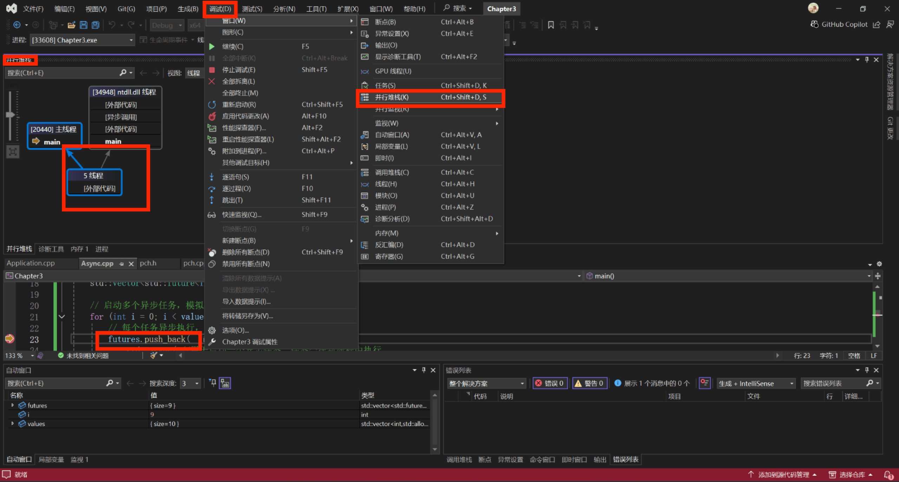

---
tags:
  - Cpp
dlink:
  - "[[../../Cpp-目录|Cpp-目录]]"
---
```ad-note
title: 运行优化

**`std::async`** 和 **`std::future`** 是C++11引入的工具，用于简化并行计算。

- **`std::async`** 启动异步任务，任务在独立线程中运行，主线程可以继续执行其他操作。
- **`std::future`** 获取异步任务的结果，调用 `get()` 会阻塞，直到任务完成。

#### 1. 并行化任务

通过 `std::async` 启动多个异步任务，例如并行计算数组中每个元素的平方。每个任务的结果通过 `std::future` 存储，调用 `get()` 获取。

#### 2. 互斥锁（`std::mutex`）

在多线程环境中，多个线程同时访问共享资源可能导致竞态条件。`std::mutex` 用于确保同一时刻只有一个线程访问共享资源，防止数据错误。

#### 3. 任务依赖关系

任务A可能会影响任务B的执行，`std::future` 的 `get()` 方法可以确保任务B在任务A完成后执行。设计并行任务时，尽量减少任务间的依赖，避免影响并行性。

#### 4. VS中调试的方法


参考：[136-线程,计时](136-线程,计时.md)

```

```cpp title:运行优化
#include <iostream>
#include <vector>

#include <future> //future一个就够

// 定义一个函数，模拟对每个任务的处理
int process_task(int value) {
    std::this_thread::sleep_for(std::chrono::milliseconds(500));  // 模拟耗时操作
    return value * value;  // 假设任务是计算每个数字的平方
}

int main()
{
    // 创建一个整数数组，模拟需要处理的任务
    std::vector<int> values = {1, 2, 3, 4, 5, 6, 7, 8, 9, 10};

    // 用于存储每个任务的future对象
    std::vector<std::future<int>> futures;

    // 启动多个异步任务，模拟并行处理for循环中的每个任务
    for (int i = 0; i < values.size(); ++i) {
        // 每个任务异步执行，传入不同的值
        futures.push_back(
        	std::async(	//用于启动一个异步任务，任务会在新线程中执行
        	std::launch::async, //强制任务在新的线程中执行
        	process_task, // 异步任务要执行的函数
        	values[i] //将 values[i] 作为参数传递给 process_task 函数
        	)
        );
    }

    // 处理完所有任务后，获取每个任务的结果
    for (int i = 0; i < values.size(); ++i) {
        // 获取任务的结果，这里会阻塞直到每个任务完成
        int result = futures[i].get();
        std::cout << "任务 " << values[i] << " 结果是: " << result << std::endl;
    }

    std::cin.get();  // 等待用户按键，以便查看输出
}

```

```ad-note
title: 字符串优化
输入文字

主要是堆和栈内存分配的问题 参考：[131-栈和堆内存区别](131-栈和堆内存区别.md)

```

```cpp title:字符串优化
#include <iostream>

int main()
{

	std::cin.get();
}
```

```ad-note
title: 小字符串优化
输入文字


```

```cpp title:小字符串优化
#include <iostream>

int main()
{

	std::cin.get();
}
```